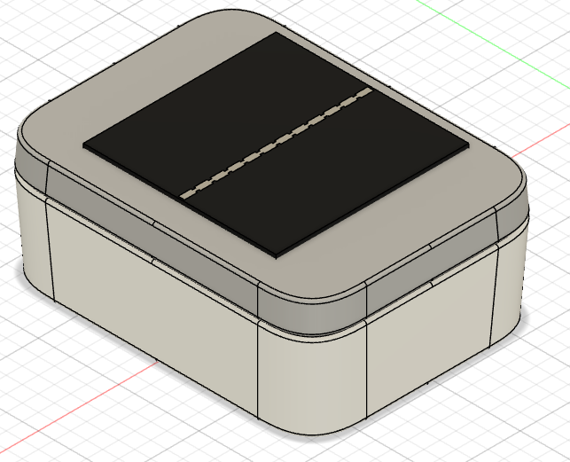
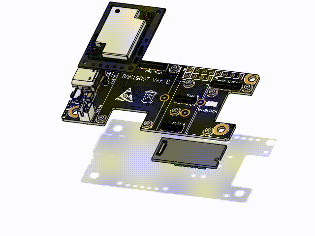
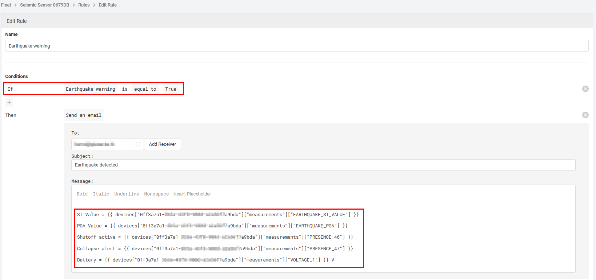
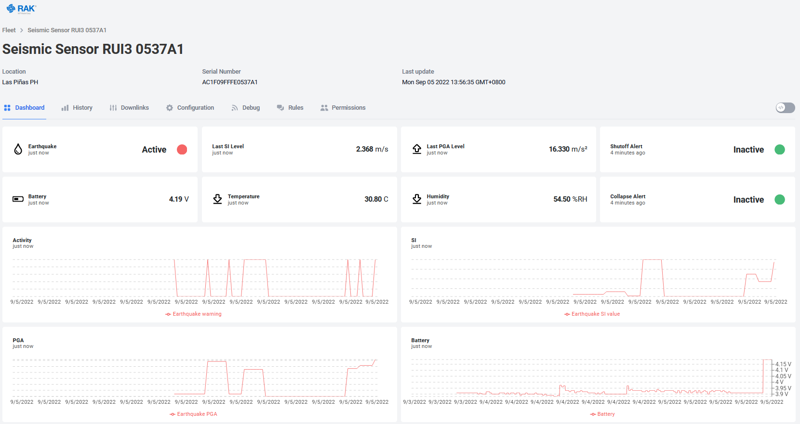

# RAK12027 WisBlock Seismic Sensor

|  |  |  |  |
| -- | -- | -- | -- |

Earthquakes can be dangerous and are often unpredictable. Seismic stations all around the world are measuring seismic activities. With the D7S module Omron created an affordable sensor that can detect earthquakes and measure their intensity as SI values. The SI values have a high correlation with the seismic intensity scale that indicates the magnitude of an earthquake.    
While this product cannot be used to predict earthquakes, it is a good solution to send warnings and protect sensitive machinery in case an earthquake occurs. Beside of measuring the strength, it generates a warning signal if the SI level is higher than 5 that can be used to shutdown machinery. It detects as well if the horizontal position of the sensor changes, which points towards a collapse of the structure where the sensor was deployed.

Please check out Omrons documentation for the D7S module:
- [_**D7S Vibration Sensor**_](https://components.omron.com/us-en/products/sensors/D7S)
- [_**D7S Seismic Sensor**_](https://components.omron.com/us-en/solutions/sensor/seismic-sensors)
- [_**D7S datasheet**_](https://components.omron.com/us-en/datasheet_pdf/A252-E1.pdf)
- [_**D7S Video 1**_](https://www.youtube.com/embed/d7PJ3fCwQ-8?rel=0&autoplay=1)
- [_**D7S Video 2**_](https://www.youtube.com/embed/vNTC2ONmp0I?rel=0&autoplay=1)

Using the small sized [_**RAK12027 Seismic Sensor**_](https://docs.rakwireless.com/Product-Categories/WisBlock/RAK12027/Overview) together with the WisBlock Core and WisBlock Base modules makes it very easy to build up the earthquake warning system.

This example can be used as a start point to write a low power consumption seismic alarm system that can be powered by battery and solar panel. The consumption in sleep mode is ~90uA. The code is completely interrupt based to keep the MCU as much as possible in sleep mode to save battery. The collected data of an earthquake is sent over LoRaWAN, but it can be used as well with LoRa P2P. It will send data packets after the D7S has finished it's data processing with the information of the SI level, PGA, shutdown alert and collapse alert signal.

# Content
- [RAK products used in this project](#rak-products-used-in-this-project)
   - [Assembly](#assembly)
- [How it works](#how-it-works)
- [Libraries used](#libraries-used)
- [Source Code](#source-code)
   - [Seismic Sensor code for RAK4631 using the RAK-nRF52 BSP for Arduino](#seismic-sensor-code-for-rak4631-using-the-rak-nrf52-bsp-for-arduino)
   - [Seismic Sensor code for RAK4631-R and RAK3172 using the RAK RUI3 API](#seismic-sensor-code-for-rak4631-r-and-rak3172-using-the-rak-rui3-api)
   - [Setup of the RAK12027 Seismic Sensor](#setup_of_the_rak12027_seismic_sensor)
- [Data packet format](#data-packet-format)
- [Example for a visualization and alert message](#example-for-a-visualization-and-alert-message)

# RAK products used in this project

This project uses the [_**RAK19007**_](https://docs.rakwireless.com/Product-Categories/WisBlock/RAK19007/Overview) Base Board, the [_**RAK12027**_](https://docs.rakwireless.com/Product-Categories/WisBlock/RAK12027/Overview) Seismic Sensor and optional the [_**RAK1901**_](https://docs.rakwireless.com/Product-Categories/WisBlock/RAK1901/Overview) Temperature and Humidity Sensor.    
In case the firmware is built with the RAK-nRF52 Arduino BSP, it uses the [_**RAK4631**_](https://docs.rakwireless.com/Product-Categories/WisBlock/RAK4631/Overview) Core Module.    
In case the RAK RUI3 API is used for the firmware, it uses the [_**RAK4631-R**_](https://docs.rakwireless.com/Product-Categories/WisBlock/RAK4631-R/Overview) Core Module.    

## Assembly

Place the WisBlock Core and WisBlock Sensor module in the following slots of the RAK19007 Base Board:    


Make sure to fix the modules with the screws coming with the WisBlock modules. In case of an heavy earthquake they might fall off the Base Board if not secured with the screws.

For the enclosure I used the [Unify Enclosure RAKBox-UO100x75x38](https://docs.rakwireless.com/Product-Categories/WisBlock/RAKBox-UO100x75x38/Overview).    
Depending on the size of the used battery, there are two mounting options.

Assemble the WisBlock Base board on the mounting plate.    


When using a smaller and thin battery (30 x 55 x 6 mm w x l x h), the battery can be placed below the mounting plate.


Fix the mounting plate inside the enclosure.


If using a larger battery, use stand-offs and a battery carrier like the one from our [_**Awesome WisBlock**_](https://github.com/RAKWireless/Awesome-WisBlock/tree/main/Unify-Enclosure#second-level-battery-holder) repo to fix the battery above the WisBlock.    


# How it works

Both the RUI3 and the Arduino code are based on interrupts and timers. After joining the LoRaWAN network, the MCU goes into sleep mode until it    
- wakes up from an interrupt coming from the D7S sensor
- wakes up from a timer to send a frequent "_**I am Alive**_" message    

On wakeup, the code then checks for the wakeup reason and handles the situation.     
There are 4 different interrupt events:
- (1) Earthquake start detected (INT2 falling edge of the D7S)
- (2) Earthquake analysis  finished  (INT2 raising edge of the D7S)
- (3) Shutoff alert (INT1 falling edge of the D7S)
- (4) Collapse alert (INT1 falling edge of the D7S)

(1) just sets a flag as reminder that an earthquake was detected
(2) reads out the detected SI and PGA level and sends a packet to the LoRaWAN server
(3) and (4) set a flag whether a shutoff alert or collapse alert was set

After sending the data packet in (2), a timer is started to send a second packet with the alert flags cleared.

The frequent send timer is just sending a small packet to signal the LoRaWAN server that the sensor is still alive. This packet contains the battery level and, if assembled, the temperature and humidity values measured with the RAK1901.

# Libraries used

Both the Arduino and the RUI3 code use the [_**D7S library**_](https://github.com/alessandro1105/D7S_Arduino_Library) provided by Alessandro Pasqualini. I couldn't find the library in the Arduino Library Manager, so you have to download the repo as a ZIP file and install it manually.

For the encoding of the data packets the [_**CayenneLPP library**_](https://github.com/ElectronicCats/CayenneLPP) is used.    
For the RAK1901 sensor the [_**SparkFun SHTC3 Humidity and Temperature Sensor Library**_](https://github.com/sparkfun/SparkFun_SHTC3_Arduino_Library) is used.    
These two libraries can be installed with the Arduino Library Manager.

The Arduino version uses in addition the [_**WisBlock-API**_](https://github.com/beegee-tokyo/WisBlock-API), which can be installed with the Arduino Library Manager as well.

## Source Code

## Seismic Sensor code for RAK4631 using the RAK-nRF52 BSP for Arduino

The Arduino code is based on the [_**WisBlock-API**_](https://github.com/beegee-tokyo/WisBlock-API), an event driven framework that handles all communication tasks in the background and just waits for a timer or external interrupt to wake up.    
The provided code is for PlatformIO, but can easily be changed to work in the Arduino IDE.

Depending on the Sensor Slot used, the D7S interrupts INT1 and INT2 need to be assigned to the correct GPIO's. This can be done in the platformio.ini files with the **`build_flags`** option:

```
build_flags = 
	-DRAK12027_SLOT=A ; A = Slot A, B = Slot B, C = Slot C, D = Slot D, E = Slot E, F = Slot F
```

If using Arduino IDE, the correct assignment has to be done in the **`RAK12027_seismic.cpp`** file.

The Arduino based firmware has an AT command interface, the available AT commands can be found in the [_**AT Command Manual**_](https://docs.rakwireless.com/Product-Categories/WisBlock/RAK10700/AT-Command-Manual/)

## Seismic Sensor code for RAK4631-R and RAK3172 using the RAK RUI3 API

The RUI3 based code is working on the RAK4631-R and RAK3172 modules without any change in the code.    
The assignment of the D7S interrupts INT1 and INT2 need to be assigned in the **`RAK12027_seismic.cpp`** file.

## Setup of the RAK12027 Seismic Sensor

The functions to setup the sensor and handle the sensor interrupts are nearly the same for Arduino and RUI3. The main difference is how the interrupt handlers wake up the MCU to check the source of the interrupts.

In the **`init_rak120271()** function the sensor is initialized and calibrated. The calibration is necessary, as the sensor will determine his horizontal position. This is required for both the earthquake detection and the collapse alert.    
This function assigns as well the interrupt handlers for the two interrupt sources from the D7S sensor.    

For Arduino, the two interrupt handlers wake up the loop by releasing a semaphore with the **`api_wake_loop()`** call. They set as well the reason for the wakeup, so that it can be handled in the application.
```cpp
/**
 * @brief Callback for INT 1
 * Wakes up application with signal SEISMIC_ALERT
 * Activated on Collapse and Shutoff signals
 *
 */
void d7s_int1_handler(void)
{
	api_wake_loop(STATUS | SEISMIC_ALERT);
}

/**
 * @brief Callback for INT 2
 * Wakes up application with signal SEISMIC_EVENT
 * Activated on Earthquake start and end
 *
 */
void d7s_int2_handler(void)
{
	if (digitalRead(INT2_PIN) == LOW)
	{
		digitalWrite(LED_BLUE, HIGH);
	}
	else
	{
		digitalWrite(LED_BLUE, LOW);
	}
	api_wake_loop(STATUS | SEISMIC_EVENT);
}
```

As RUI3 doesn't support semaphores and tasks, the interrupt handlers call directly the **`sensor_handler()`** function.
```cpp
/**
 * @brief Callback for INT 1
 * Wakes up application with signal SEISMIC_ALERT
 * Activated on Collapse and Shutoff signals
 *
 */
void d7s_int1_handler(void)
{
	g_task_event_type = SEISMIC_ALERT;
	sensor_handler(NULL);
}

/**
 * @brief Callback for INT 2
 * Wakes up application with signal SEISMIC_EVENT
 * Activated on Earthquake start and end
 *
 */
void d7s_int2_handler(void)
{
	if (digitalRead(INT2_PIN) == LOW)
	{
		digitalWrite(LED_BLUE, HIGH);
	}
	else
	{
		digitalWrite(LED_BLUE, LOW);
	}
	g_task_event_type = SEISMIC_EVENT;
	sensor_handler(NULL);
}
```

# Data packet format

The data packet is encoded in an extended CayenneLPP format based on the [_**CayenneLPP format**_](https://github.com/ElectronicCats/CayenneLPP) provided by ElectronicCats. This format is supported by most LoRaWAN network servers and integrations, but as an extended version is used here, it will need a custom payload decoder. A set of payload decoders for different LoRaWAN network servers and integrations are in the [_**decoders**_](./decoders) folder.

The channel ID's used for the different values are:

| Channel Name            | Channel ID | Type              | Value                                                                   |    
| ----------------------- | ---------- | ----------------- | ----------------------------------------------------------------------- |    
| LPP_CHANNEL_BATT        | 1          | Voltage           | Battery voltage in V                                                    |
| LPP_CHANNEL_HUMID       | 2          | Relative Humidity | RAK1901 Humidity in %RH                                                 |
| LPP_CHANNEL_TEMP        | 3          | Temperature       | RAK1901 Temperature in °C                                               |
| LPP_CHANNEL_EQ_EVENT    | 43         | Presence          | RAK12027 Earthquake active, boolean value, true if earthquake is active |
| LPP_CHANNEL_EQ_SI       | 44         | Analog            | RAK12027 Detected SI value, analog value 1/10th in m/s                  |
| LPP_CHANNEL_EQ_PGA      | 45         | Analog            | RAK12027 Detected PGA value, analog 10 * value in m/s2                  |
| LPP_CHANNEL_EQ_SHUTOFF  | 46         | Presence          | RAK12027 Shutoff alert, boolean value, true if alert is raised          |
| LPP_CHANNEL_EQ_COLLAPSE | 47         | Presence          | RAK12027 Collapse alert, boolean value, true if alert is raised         |

To get a higher precision the SI and PGA values are multiplied by 10 before sending them. The Cayenne LPP format supports only 0.01 precision. The values must be divided by 10 to get the real values.

The packet sent out displayed as hex values looks like this:
0x2b 0x66 0x01 0x2c 0x02 0x00 0xab 0x2d 0x02 0x19 0x28 0x2e 0x66 0x01 0x2f 0x66 0x00 0x01 0x74 0x01 0x9b 0x02 0x68 0x77 0x03 0x67 0x01 0x81

| Bytes | Meaning | Value in Hex | Value |
| -- | -- | -- | -- |
| 1 | Channel ID 43 for EQ event | 0x2b | |
| 2 | Channel type for presence | 0x66 | |
| 3 | Status of presence 0 = off, 1 = on | 0x01 | ON |
| 4 | Channel ID 44 for SI value | 0x2c | |
| 5 | Channel type for analog value | 0x02 | |
| 6, 7 | SI value | 0x00 0xab | 1.71 = 0.171 m/s|
| 8 | Channel ID 44 for PGA value | 0x2d | | 
| 9 | Channel type for analog value | 0x02 | | 
| 10, 11 | PGA value | 0x19 0x28 | 64.4  = 6.44 m/s^2 |
| 12 | Channel ID 46 for Shutoff event | 0x2e | |
| 13 | Channel type for presence | 0x66 | |
| 14 | Status of presence 0 = off, 1 = on | 0x01 | ON |
| 15 | Channel ID 47 for Collapse event | 0x2f | |
| 16 | Channel type for presence | 0x66 | |
| 17 | Status of presence 0 = off, 1 = on | 0x00 | OFF |
| 18 | Channel ID 1 for battery voltage | 0x01 | |
| 19 | Channel type for voltage | 0x74 | |
| 20, 21 | Voltage level | 0x01 0x9b | 4.11V |
| 22 | Channel ID 2 for humidity | 0x02 | |
| 23 | Channel type for analog value | 0x68 | |
| 24 | Humidity value | 0x77 | 59.5 %RH |
| 25 | Channel ID 3 for temperature | 0x03 | | 
| 26 | Channel type for temperature | 0x67 | | 
| 27, 28 | temperature value | 0x01 0x81 | 38.5 deg C |

# Example for a visualization and alert message

As an simple example to visualize the earthquake data and sending an alert, I created a device in [_**Datacake**_](https://datacake.co).    
Datacake is an easy to use _**Low Code IoT Platform**_. In my Datacake account I setup the device with the matching payload decoder, visualization and creation of an email alert.

## Datacake payload decoder
In the device configuration the Datacake decoder from the [_**decoders**_](./decoders) folder is used.

## Datacake fields
As the SI and PGA values are sent as 10 times of the value, beside of the data fields a formula feed is required to transform the received values to the real values.

| Field Name |  Identifier | Type |
| --- | --- | --- |
| Earthquake warning |  PRESENCE_43 |  Boolean |  
| Earthquake SI value 100 |  ANALOG_IN_44 |  Float |  
| Earthquake PGA 100 |  ANALOG_IN_45 |  Float |  
| Battery |  VOLTAGE_1 |  Float |  
| Humidity |  HUMIDITY_2 |  Float |  
| Temperature |  TEMPERATURE_3 |  Float |  
| Shutoff Alert |  PRESENCE_46 |  Boolean |  
| Collapse Alert |  PRESENCE_47 |  Boolean |  
| Earthquake SI value |  EARTHQUAKE_SI_VALUE |  Float |  
| Earthquake PGA |  EARTHQUAKE_PGA |  Float |  
| Lora Datarate |  LORA_DATARATE |  String |  
| Lora Rssi |  LORA_RSSI |  Integer |  
| Lora Snr |  LORA_SNR |  Integer |  

## Datacake rule
To send a warning email when an earthquake occured, a Datacake rule is used to send the email.
The rule is triggered by the **`Earthquake warning`** field.


## Datacake visualization
In the dashboard you can show the current status and the latest SI and PGA levels.    


